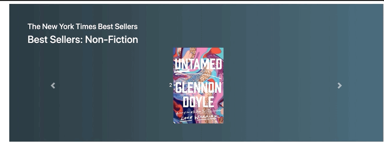
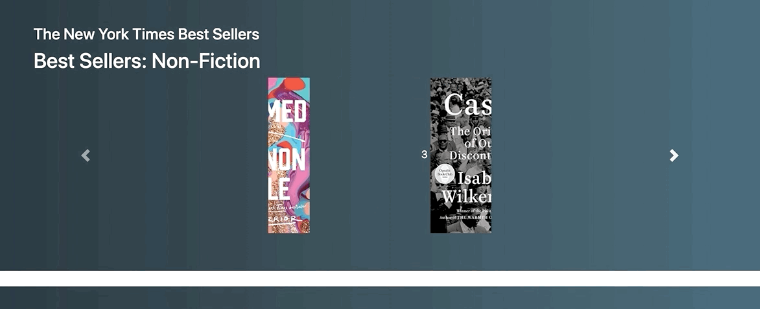
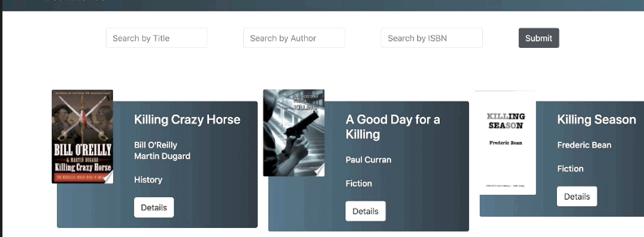

# Book Store Application

The Book Explorer Web Application is designed to showcase frontend development skills with a focus on ReactJS and responsive design. This application enables users to explore a variety of books, offering functionality to view, search, and filter books based on different criteria.

# Technologies Used

- HTML
- CSS
- JavaScript
- React.js
- Bootstrap
- Books API - https://d1krvzwx5oquy1.cloudfront.net/books.json

## Core Features
- <b>Book Listing:</b> Displays a list of books, including cover images, titles, authors, and ratings.
- <b>Basic Filtering:</b> Allows users to filter books by genre or author.
- <b>Responsive Design:</b> Ensures a seamless experience across all devices, adapting to mobile, tablet, and desktop screens.
- <b>API Integration:</b> Utilizes this API endpoint to fetch and display book data.
- <b>Detail View:</b> Provides a detailed view of each book, offering more information upon selection.

## Folder Structure
- #### public
- #### src
   - ##### components
      - ###### BookDetails
      - ###### BookList
      - ###### Cagegory
      - ###### Footer
      - ###### Home
      - ###### Nav
      - ###### NotFound
      - ###### BestSeller
      - ###### SearchForm
   - ##### App.js
   - ##### index.js
   - ##### index.scss
- #### package.json
- #### output GIF
- #### README.md

## Challenges and Solutions
- <b>Responsive Layout:</b>
Implementing a responsive layout posed a challenge due to the varying sizes and resolutions of devices. This was addressed by using Tailwind CSS's responsive utilities, which enabled rapid development of a flexible layout that adapts to any screen size.

- <b>API Integration:</b>
Managing asynchronous data fetching from the API was challenging, especially handling loading states and potential errors. Axios was used to simplify these tasks, coupled with React's useEffect hook to handle side effects in a declarative way.

### Output Screen

#### Preview the book
  

#### Book
   

#### Navigate the book
  

  #### Search features
  